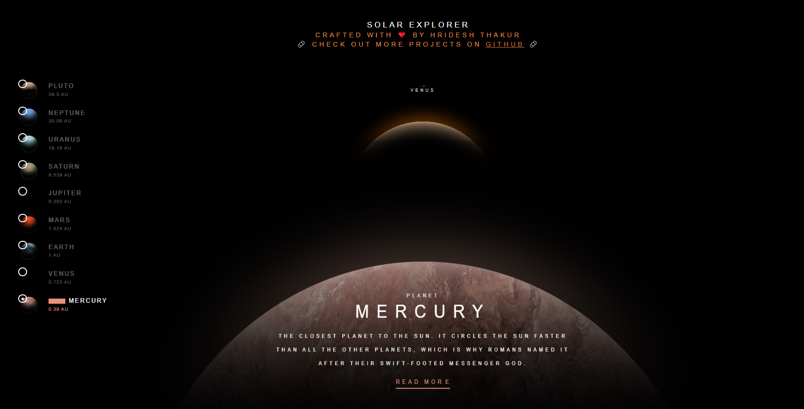

# 🌌 Solar Explorer

An interactive **3D Solar System Explorer** that lets you discover planets with beautiful visuals and smooth transitions.  
Crafted with ❤️ by **Hridesh Thakur**.

  


---

## ✨ Features
- 🌍 Explore all major planets (and Pluto 😉)
- 🪐 Smooth animations & transitions
- 📖 Planet info with distance from the Sun
- 🎨 Modern and aesthetic UI
- ⚡ Built with HTML, CSS, and JavaScript

---


## 🛠️ Installation & Setup
1. Clone the repository:
   ```bash
   git clone https://github.com/Hridesh-Thakur/solar-explorer.git
